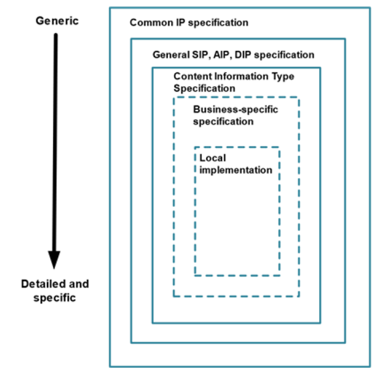
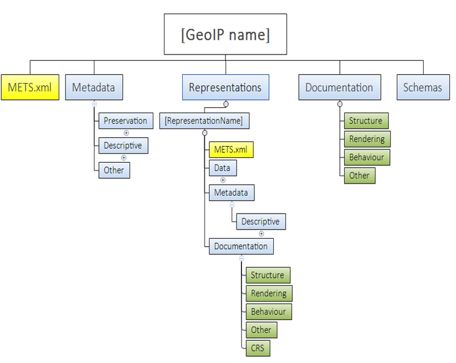
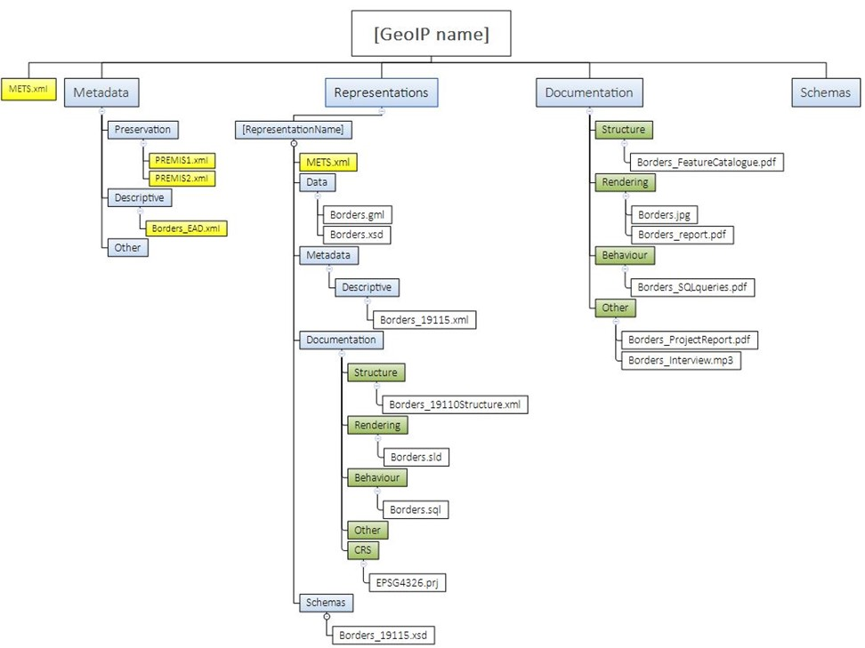

**Specification for the E-ARK Content Information Type Specification for
digital geospatial data records archiving (CITS Geospatial)**

*[A proper front page will be created for the publication occurring
after implementation of review comments.]*

# Preface

*To be added from Common Preface https://github.com/DILCISBoard/spec-publisher/blob/master/res/md/common-intro.md*

# Context

## Purpose

The purpose of this document is to describe the Content Information Type
Specification for Geospatial records (CITS Geospatial). This
specification describes how to package files containing geospatial
records in a CSIP package(s) and the extension of the E-ARK SIP. It is
designed to be used for the transfer of different types of Geospatial
records and resources to and from archives.

**NOTE**: Throughout this document the acronym CSIP will be used to
describe the combination of CSIP and SIP.

## Scope

Geospatial records are any digital records that describe an object in
space using coordinates based on a geographic coordinate system and a
set of descriptive elements called attributes. They are created in many
different proprietary formats but mostly come in two forms, vector data
(points, lines, polygons) and raster data (sets of one or multiple
arrays of pixels).

The CITS Geospatial specification scope describes how geospatial data
files, metadata files, schema files for validation, documentation, and
other files should be placed and structured into the CSIP based
structure when producing a CITS Geospatial SIP for transfer to long-term
preservation.

This specification is general enough to support multiple types of
geospatial records (not only vector and raster-based records).
Therefore, the specification does not define mandatory long-term
preservation formats. Instead, it provides a possibility of extensions,
the so-called *[Long-term preservation format Profiles]{.underline}*,
that need to comply with general requirements. Examples of such Profiles
for vector data (GML) and raster data (GeoTIFF) are provided in the
Guideline that accompanies this document. An example of a Profile for
GIS in its own guideline which also accompanies this document. Profiles
for other geospatial records formats (like proprietary data formats, earth
observations, point clouds, oblique images, web services, etc.) are not
proposed at this stage. They will be added later in cooperation with the
geospatial community.

Description of the two accompanying guidelines:

-   The first accompanying guideline document (*Guideline for the
    specification for the E-ARK Content Information Type Specification
    for Geospatial data (CITS Geospatial)*) provide a basic introduction
    to the field of geospatial data and the concepts used in this
    specification. In the Guideline there is also a description of the
    Profile for using the INSPIRE directive, with the CITS Geospatial
    both as the content being transferred and how to map INSPIRE
    information to an archival finding aid.

-   The second guideline document (*Guideline for using the
    specification for the E-ARK Content Information Type Specification
    for Geospatial data (CITS Geospatial) with GIS*) provides the
    information on how to extend the first accompanying guideline
    document with content describing preservation of selected elements
    from Geographical Information Systems (GIS). The guideline aims to
    extend the scope of preservation beyond the geospatial data records
    themselves and focus more on GIS elements defining the geospatial
    information products.

A glossary for archival and geodata terms to facilitate the readability
of the specification is present at the beginning of this document.

## Information Package Layered data model

This section introduces the role of the CITS Geospatial and its
dependencies on basic structures of the Information package.

**This specification is created based on the requirements of the Common
Specification for Information Packages (CSIP) and the Specification for
Submission Information Packages (E-ARK SIP). To fully understand its
requirements, we highly recommend that users learn and understand the
requirements and the terminology of the initial documents, before using
this specification.**

The data model structure is based on a layered approach for information
package definitions (Figure 2). The Common Specification for Information
Packages (CSIP) forms the outermost layer.

The general SIP, AIP and DIP specifications add submission, archiving
and dissemination information to the CSIP specification.

The third layer of the model represents specific Content Information
Type Specifications (CITS), such as this CITS Geospatial specification.

Additional layers for business-specific specifications and local variant
implementations of any specification can be added to suit the needs of
the organisation.

**Figure 1:** Data Model Structure

Every level in the data model structure inherits metadata entities and
elements from the higher levels. In order to increase adoption, a
flexible schema has been developed. This will allow for extension points
where the schema in each layer can be extended to accommodate additional
information on the next specific layer until, finally, the local
implementation can add specific entities or metadata elements to satisfy
very specific local needs. Extension points can be implemented by:

-   Embedding foreign extension schemas (in the same way as supported by
    METS \[http://www.loc.gov/standards/mets/\] and PREMIS \[http://www.loc.gov/standards/premis/\]). These support both increasing the granularity of existing metadata elements by using more detailed data structures as well as adding new types of metadata.

-   Substituting metadata schemas for standards more appropriate for the
    local implementation.

The structure allows the addition of more detailed requirements for
metadata entities, for example, by:

-   Increasing the granularity of metadata elements by using more
    detailed data structures, or

-   Adding local controlled vocabularies.

For consistency, design principles are reused between layers as much as
possible.

# CITS Geospatial requirements structure

The Content Information Type Specification for Geospatial data aims to
define the necessary elements required to preserve the accessibility and
authenticity of geospatial records over time and across changing
technical environments. To achieve this, this specification defines the
categories of significant properties \[Source:
<https://significantproperties.kdl.kcl.ac.uk/> \] for geospatial records
to allow the digital geospatial information products to remain
accessible and meaningful. For every geospatial record or a set of
records, we need to preserve information that suits the following
categories:

-   **Content** -- Information contained within the Information Object.
    For example, location information (coordinates, orientation, pixel
    size), geometry, related feature attributes, etc. This is stored
    within the \"*[Data\" folder]{.underline}* within a Representation.

-   **Context** -- Any information that describes the environment in
    which the content was created or that affects its intended meaning.
    Examples: Creator name, date of creation, spatial accuracy, source
    data, sensor information, etc. This type of information can be
    provided using the \"*[Other\"]{.underline}* folder within the main
    \"*[Documentation\" folder]{.underline}* or by providing various
    *Geospatial Metadata* located within the Representation
    [Metadata/Descriptive]{.underline} folder*[.]{.underline}*

-   **Structure** -- Information that describes the extrinsic or
    intrinsic relationship between two or more types of content, as
    required to reconstruct the performance. For example, a Raster
    object and its connection to the world file, or a vector dataset
    combined with a table, a GIS project, defining the structure of
    geodata layers used to create a map, configuration of web services,
    defining a mash-up WMS, etc. This information should preferably be
    provided using standardised machine-readable files or at least in
    written documentation.

-   **Rendering** -- Any information that contributes to the recreation
    of the performance of the Information Object. Example: Colour map of
    pixel values of a raster; Styled Description layer for web services,
    documentation describing a cartographic map project, Report designs,
    etc.

-   **Behaviour** -- Properties that indicate the method in which
    content interacts with other stimuli. Example --rendering
    algorithms, analysis functionalities, standard transformation
    processes, documentation of original system functionality, user
    manuals, training materials, system usage videos, etc.

**Figure 2:** CITS Geospatial extension folders for Information Packages

## Folder structure requirements

The CITS Geospatial information structure inherited its package
structure from the E-ARK Common Specification for Information Packages
(CSIP) (blue elements), and it is an extension of it (green elements).

A visualisation of a valid CITS Geospatial Information Package is
illustrated in Figure 3. This Figure shows an example of a simple valid
Information Package with one representation of a single vector dataset
in a GML file format.

**Figure 3:** Example Information Package folder structure

The folder structure in CSIP described in section
<https://earkcsip.dilcis.eu/#folderstructureofthecsip> is extended with
the following geo specific requirements on the folder structure:

**GEOSTR1:** XML schema documents for any structured descriptive
geospatial metadata within package **MUST** be placed in a sub-folder
called schemas within the Information Package root folder and/or the
representation folder. This requirement is an extension of CSIPSTR15.

**GEOSTR2:** A documentation folder on package or representation level
**SHOULD** include a subfolder named structure. This requirement is an
extension of CSIPSTR16.

**GEOSTR3:** A documentation folder on package or representation level
**SHOULD** include a subfolder named rendering. This requirement is an
extension of CSIPSTR16.

**GEOSTR4:** A documentation folder on package or representation level
**SHOULD** include a subfolder named behaviour. This requirement is an
extension of CSIPSTR16.

**GEOSTR5:** A documentation folder on package or representation level
**SHOULD** include a subfolder named CRS*.* This requirement is an
extension of CSIPSTR16.

**GEOSTR6:** A documentation folder on package or representation level
**SHOULD** include a subfolder named other. This requirement is an
extension of CSIPSTR16.

## METS Requirements

### Package and Representation METS

Generally, CSIP can consist of zero to many
representations, and this is an important feature that needs to be
considered when packing geodata files within CSIPs.

There can easily be different representations of the
same geospatial content located within one CSIP. For example, one
package could consist of:

-   one representation with geodata in original format;
-   one representation with geodata in a long-term preservation format;
-   one representation with geodata in dissemination formats;

There can be several representations of dissemination
formats. There can also be many different types of geodata records and
databases within the same package.

As for the CITS Geospatial specification, there
always needs to be a minimum of one representation and therefore a
minimum of two METS.xml. The Package METS.xml must be a general METS.xml
stating if the package mainly contains Geospatial Records. Then, the
Representation METS.xml describes the specific main data types in the
representation.

A CITS Geospatial builds upon the general CSIP
requirements, which are presupposed but not explicitly mentioned here.
Those requirements should be met before applying the requirements listed
below:

**Table 2:** Geospatial information package requirement

<table>
<colgroup>
<col style="width: 13%" />
<col style="width: 67%" />
<col style="width: 19%" />
</colgroup>
<thead>
<tr class="header">
<th>ID</th>
<th>Name, Location &amp; Description</th>
<th>Card &amp; Level</th>
</tr>
</thead>
<tbody>
<tr class="odd">
<td>GEO_1</td>
<td>
Geospatial data information package

There MUST be a minimum of one representation and, therefore a
minimum of one Package METS.xml and a minimum of one Representation
METS.xml in a CITS Geospatial compliant package.
</td>
<td>
1..1

MUST
</td>
</tr>
</tbody>
</table>

### Package METS requirements

Requirements pertaining to the information package.

**Table 3:** Requirements for the information package

<table>
<colgroup>
<col style="width: 13%" />
<col style="width: 67%" />
<col style="width: 19%" />
</colgroup>
<thead>
<tr class="header">
<th>ID</th>
<th>Name, Location &amp; Description</th>
<th>Card &amp; Level</th>
</tr>
</thead>
<tbody>
<tr class="odd">
<td>
GEO_2

Ref CSIP2
</td>
<td>
Type

mets/@TYPE [Description of the element]

For information packages that primarily contain geospatial data, the
value in Package mets/@TYPE MUST be "Geospatial Data" as taken from the
CSIP Vocabulary for <a
href="https://earkcsip.dilcis.eu/schema/CSIPVocabularyContentCategory.xml">Content
Category</a>.

<strong>See also:</strong> <a
href="https://earkcsip.dilcis.eu/#VocabularyContentCategory">Content
Category</a>
</td>
<td>
1..1

MUST
</td>
</tr>
<tr class="even">
<td>
GEO_3

Ref CSIP4
</td>
<td>
Content Information Type Specification

mets/@csip:CONTENTINFORMATIONTYPE

For information packages that primarily contain geospatial data, the
value in Package mets/@csip:CONTENTINFORMATIONTYPE MUST be
"citsgeospatial_v3_0 " as taken from the CSIP Vocabulary for Detailed
Content Type.

<strong>See also:</strong> <a
href="https://earkcsip.dilcis.eu/#VocabularyContentInformationTypeSpecification">Content
information type specification</a>
</td>
<td>
1..1

MUST
</td>
</tr>
<tr class="odd">
<td>
GEO_4

Ref CSIP5
</td>
<td>
Other Content Information Type Specification

mets/@csip: OTHERCONTENTINFORMATIONTYPE

For information packages that primarily contain geospatial data, the
Package METS <strong>MUST NOT</strong> have a
mets/@csip:OTHERCONTENTINFORMATIONTYPE
</td>
<td>
0..0

MUST NOT
</td>
</tr>
<tr class="even">
<td>
GEO_5

Ref CSIP6 SIP2
</td>
<td>
METS Profile

mets/@PROFILE

For information packages that primarily contain geospatial data, the
value in the @PROFILE <strong>MUST</strong> be "
https://citsgeospatial.dilcis.eu/profile/E-ARK-GEOSPATIAL-ROOT.xml
".
</td>
<td>
1..1

MUST
</td>
</tr>
<tr class="odd">
<td>
GEO_6

Ref CSIP62
</td>
<td>
fileSec Representation Content Information Type Specification

mets/fileSec/fileGrp[@USE='Representations']/@csip:CONTENTINFORMATIONTYPE

There <strong>MUST</strong> be a minimum of one
mets/fileSec/fileGrp[@USE='Representations']/@csip:CONTENTINFORMATIONTYPE
with the value “citsgeospatial_v3_0” as taken from the CSIP Vocabulary
for Detailed <a
href="https://earkcsip.dilcis.eu/schema/CSIPVocabularyContentInformationType.xml">Content
Type</a> that direct to the representation METS.xml in the
representation folder containing geospatial data.
</td>
<td>
1..n

MUST
</td>
</tr>
<tr class="even">
<td>
GEO_7

Ref CSIP105-CSIP112
</td>
<td>
fileSec Representation Content Information Type Specification

mets/fileSec/fileGrp[@USE='Representations']/@csip:CONTENTINFORMATIONTYPE

For any fileGrp/@csip:CONTENTINFORMATIONTYPE with the value
"citsgeospatial_v3_0 " there <strong>MUST</strong> be a corresponding
@div-representation in the StructMap-element
</td>
<td>
1..1

MUST
</td>
</tr>
</tbody>
</table>

### Representation METS requirements

Requirements pertaining to the representation package.

**Table 4:** Requirements for the representation information package

<table>
<colgroup>
<col style="width: 13%" />
<col style="width: 67%" />
<col style="width: 19%" />
</colgroup>
<thead>
<tr class="header">
<th>ID</th>
<th>Name, Location &amp; Description</th>
<th>Card &amp; Level</th>
</tr>
</thead>
<tbody>
<tr class="odd">
<td>
GEO_8

Ref CSIP2
</td>
<td>
Type

mets/@TYPE

For representations that primarily contain geospatial data the value
in Package mets/@TYPE <strong>MUST</strong> be "Geospatial Data" as
taken from the CSIP Vocabulary for <a
href="https://earkcsip.dilcis.eu/schema/CSIPVocabularyContentCategory.xml">Content
Category</a>.

<strong>See also:</strong> <a
href="https://earkcsip.dilcis.eu/#VocabularyContentCategory">Content
Category</a>
</td>
<td>
1..1

MUST
</td>
</tr>
<tr class="even">
<td>
GEO_9

Ref CSIP4
</td>
<td>
Content Information Type Specification

mets/@csip:CONTENTINFORMATIONTYPE

For representations that primarily contain geospatial data and that
conforms to CITS Geodata, the value in Package
mets/@csip:CONTENTINFORMATIONTYPE <strong>MUST</strong> be
"citsgeospatial_v3_0 " as taken from the CSIP Vocabulary for Detailed <a
href="https://earkcsip.dilcis.eu/schema/CSIPVocabularyContentInformationType.xml">Content
Type</a>

<strong>See also:</strong> <a
href="https://earkcsip.dilcis.eu/#VocabularyContentInformationTypeSpecification">Content
information type specification</a>
</td>
<td>
1..1

MUST
</td>
</tr>
<tr class="odd">
<td>
GEO_10

Ref CSIP6 SIP2
</td>
<td>
METS Profile

mets/@PROFILE

For information packages that primarily contain geospatial data the
value in the @PROFILE <strong>MUST</strong> be
"https://citsgeospatial.dilcis.eu/profile/E-ARK-GEOSPATIAL-REPRESENTATION.xml
"
</td>
<td>
1..1

MUST
</td>
</tr>
</tbody>
</table>

## Data requirements (Geospatial data)

This chapter states the requirements for the content
data object or objects that form the geospatial record contained in the
Information package.

The sections 3.3 – 3.5 of this document do not discuss optimisations
with respect to packaging and storage. The requirements for data,
metadata and documentation only suggest what information is needed and
the appropriate placement of it, not how it is packaged, stored and
optimised for automatic handling.

### Geodata general - requirements

The general requirements for the content data object or objects are
stated in the following table.

**Table 5:** General requirements for the content data object

<table>
<colgroup>
<col style="width: 13%" />
<col style="width: 67%" />
<col style="width: 19%" />
</colgroup>
<thead>
<tr class="header">
<th>ID</th>
<th>Name, Location &amp; Description</th>
<th>Card &amp; Level</th>
</tr>
</thead>
<tbody>
<tr class="odd">
<td>GEO_11</td>
<td>
Minimum one file in a geospatial format

If the value in mets/@csip: CONTENTINFORMATIONTYPE is
"citsgeospatial_v3_0 ", then there <strong>SHOULD</strong> exist at
least one file in a geospatial format in
representations/[RepresentationName]/data
</td>
<td>
0..n

SHOULD
</td>
</tr>
<tr class="even">
<td>GEO_12</td>
<td>
Subfolders in data representations/[RepresentationName]/data

If there are more geospatial records in a representation, each
geospatial file <strong>MAY</strong> be placed or grouped in subfolders
in representations/[RepresentationName]/data
</td>
<td>
0..n

MAY
</td>
</tr>
<tr class="odd">
<td>GEO_13</td>
<td>
Long term preservation format representation

The Information Package <strong>SHOULD</strong> contain at least one
representation of geospatial record in a long-term preservation format,
as defined by the Archive or in the Long-term Preservation Format
Profile (See chapter 3.3.5.)
</td>
<td>
0..n

SHOULD
</td>
</tr>
<tr class="even">
<td>GEO_14</td>
<td>
Original format representation

The Information Package <strong>MAY</strong> contain a separate
representation of the same data, containing geospatial data in its
original format
</td>
<td>
0..1

MAY
</td>
</tr>
<tr class="odd">
<td>
GEO_15

Ref. 
GEO_11
</td>
<td>
CRS definition

Every geospatial dataset <strong>MUST</strong> be accompanied with
information about its underlying Coordinate Reference System (CRS) in
one of two ways:

<ul>
<li>
Full description of the CRS together with the archived data
(within the geospatial file itself or in an accompanying file)
</li>
<li>
The geospatial file contains a reference to a CRS
registry
</li>
</ul></td>
<td>
Conditional 1..1

MUST
</td>
</tr>
<tr class="even">
<td>GEO_16</td>
<td>
Geographic location validation

The geographies in the geospatial records <strong>SHOULD</strong> be
located within a fixed bounding box defined in the submission agreement
between the producer and the archive according to the expected location
and extent of the dataset
</td>
<td>
0..1

SHOULD
</td>
</tr>
<tr class="odd">
<td>GEO_17</td>
<td>
Metadata

Every geospatial dataset <strong>MUST</strong> be accompanied by a
metadata file, that describes the dataset with the basic required
information
</td>
<td>
1..n

MUST
</td>
</tr>
</tbody>
</table>

### Vector Geodata - requirements

Additional to the Geodata general requirements, the following
requirements are intended for all vector geodata in the Information
package:

**Table 6:** Requirements for vector geodata

<table>
<colgroup>
<col style="width: 13%" />
<col style="width: 67%" />
<col style="width: 19%" />
</colgroup>
<thead>
<tr class="header">
<th>ID</th>
<th>Name, Location &amp; Description</th>
<th>Card &amp; Level</th>
</tr>
</thead>
<tbody>
<tr class="odd">
<td>GEO_18</td>
<td>
Valid geospatial vector file

Any geospatial vector datafile in
representations/[RepresentationName]/data <strong>MUST</strong> be a
valid vector file compliant with its respective format requirements
(must pass the validation with the chosen validator for its
format)
</td>
<td>
1..n

MUST
</td>
</tr>
<tr class="even">
<td>GEO_19</td>
<td>
Feature attribute

Each Vector Feature dataset <strong>MUST</strong> contain at least
one Feature attribute unique to each feature instance
</td>
<td>
1..n

MUST
</td>
</tr>
<tr class="odd">
<td>GEO_20</td>
<td>
Long-Term preservation format Profile for Geospatial Vector
data

Geospatial vector data in a long-term preservation representation
<strong>SHOULD</strong> comply with the requirements for the respective
Long-Term preservation format Profile for Geospatial Vector data (see
chapter 3.3.5)
</td>
<td>
0..n

SHOULD
</td>
</tr>
</tbody>
</table>

### Raster Geodata - requirements

Additional to the Geodata general requirements, the following
requirements are intended for all raster geospatial records in the
Information package:

**Table 7:**  Requirements for raster geospatial records

<table>
<colgroup>
<col style="width: 13%" />
<col style="width: 67%" />
<col style="width: 19%" />
</colgroup>
<thead>
<tr class="header">
<th>ID</th>
<th>Name, Location &amp; Description</th>
<th>Card &amp; Level</th>
</tr>
</thead>
<tbody>
<tr class="odd">
<td>GEO_21</td>
<td>
Valid raster file

Any raster file in representations/[RepresentationName]/data
<strong>MUST</strong> be a valid raster file compliant with its
respective format requirements (must pass the validation with the chosen
validator for its format).
</td>
<td>
1..n

MUST
</td>
</tr>
<tr class="even">
<td>GEO_22</td>
<td>
Long-Term preservation format Profile for Geospatial Raster
data

Raster data in the long-term preservation representation
<strong>SHOULD</strong> comply with the requirements for the respective
Long-Term preservation format Profile for Geospatial Raster data (see
chapter 3.3.5.)
</td>
<td>
0..n

SHOULD
</td>
</tr>
<tr class="odd">
<td>GEO_23</td>
<td>
Tiling index file

If raster objects are organised using an external tiling index file,
this tiling index MAY be placed in
representations/[RepresentationName]/data
</td>
<td>
0..n

MAY
</td>
</tr>
</tbody>
</table>

### Non-spatial data - requirements

Geodata is often a part of a complex data structure, stored in a
database and ordinary tables. To reproduce the information products from
a GIS, it is often necessary to store additional tables with the
geospatial records. These tables do not have a geospatial component. In
this case, it is essential to store the data structure’s relationships
and logic to be reconstructed in the future. For long-term preservation
of additional tabular information (attribute tables, code lists, etc.)
along with geospatial records, formats proposed for RDBMS archiving are
used. For example, the standard SIARD, available at
<https://dilcis.eu/content-types/siard> and used in the Content
information Type Specification for Relational Databases using SIARD
(CITS SIARD), available at <https://dilcis.eu/content-types/cs-siard> .

### Long Term Preservation Format Profiles

A “Long Term Preservation format Profile” contains a set of one or more
base or subsets of base standards, and, where applicable, the
identification of chosen clauses, classes, options, and parameters of
those base standards, that are necessary for geospatial records to
comply with the internal Archival Long Term Preservation guidelines for
the selection of long-term preservation formats.

A “Long Term Preservation format Profile” would specify a proposed
format for long term specification, its justification according to
internal Archival guidelines (to ensure long-term preservation and
reuse), a list of required auxiliary files and documentation and
validation criteria to ensure structural and content suitability.

### Other Geospatial data

This specification does not cover any specific requirements for basic or
more complex geospatial records (such as networks, structures combining
raster and vector data, point clouds, 3D features, oblique Imagery,
Satellite Imagery, etc.). However, the specification will be extended
with “Long Term Preservation format Profiles” for additional geospatial
formats in the future.

## Documentation requirements

Geospatial records are rarely in a form that is sufficiently
self-explanatory to be used and interpreted adequately by itself.
Consequently, additional information describing context, structure,
rendering and behaviour is required to enable the user to understand,
interpret and reuse preserved geodata properly. This chapter describes
the requirements for Documentation for geospatial datasets (where it is
applicable). Ideally, a standardised machine-readable format is
preferred. However, any other form of documentation of the System is
always welcome. Standardised machine-readable formats should be placed
within the representation. Other documentation should be placed within
the package level Documentation folder.

**Table 8:** Requirement for documentation

<table>
<colgroup>
<col style="width: 13%" />
<col style="width: 67%" />
<col style="width: 19%" />
</colgroup>
<thead>
<tr class="header">
<th>ID</th>
<th>Name, Location &amp; Description</th>
<th>Card &amp; Level</th>
</tr>
</thead>
<tbody>
<tr class="odd">
<td>GEO_24</td>
<td>
Package level documentation

Documentation covering all representations in the Information package
<strong>SHOULD</strong> be placed in /documentation on package
level
</td>
<td>
0..n

SHOULD
</td>
</tr>
<tr class="even">
<td>GEO_25</td>
<td>
Representation level documentation

Documentation specific to one representation <strong>SHOULD</strong>
be placed in representations/[RepresentationName]/documentation
</td>
<td>
0..n

SHOULD
</td>
</tr>
</tbody>
</table>

### Structure of geospatial records

Structure of geospatial records describe the extrinsic or intrinsic
relationships between two or more type of content, as required to
reconstruct the performance of one or more geospatial records within the
information package.

**Table 9:** Requirements describing structure

<table>
<colgroup>
<col style="width: 13%" />
<col style="width: 67%" />
<col style="width: 19%" />
</colgroup>
<thead>
<tr class="header">
<th>ID</th>
<th>Name, Location &amp; Description</th>
<th>Card &amp; Level</th>
</tr>
</thead>
<tbody>
<tr class="odd">
<td>GEO_26</td>
<td>
Feature Catalogue documentation

A document containing definitions and descriptions of feature types
and feature attribute values <strong>SHOULD</strong> be provided for all
geospatial records in the Information Package
</td>
<td>
0..n

SHOULD
</td>
</tr>
<tr class="even">
<td>
GEO_27

ISO 19110

ISO 19115-3
</td>
<td>
Standardised machine-readable Feature Catalogue

A standardised machine-readable feature catalogue SHOULD be provided
in the Information Package
</td>
<td>
0..n

SHOULD
</td>
</tr>
<tr class="odd">
<td>
GEO_27a

Ref GEO_27
</td>
<td>
Placement of Standardised machine-readable Feature Catalogue

If a standardised machine-readable feature catalogue exits it SHOULD
be placed in
representations/[RepresentationName]/documentation/structure
</td>
<td>
0..n

SHOULD
</td>
</tr>
<tr class="even">
<td>
GEO_28

Ref GEO_27
</td>
<td>
Documentation containing Feature Catalogue descriptions

Documentation describing elements of a feature catalogue, not
compliant with GEO_27 (a non-standardised machine-readable feature
catalogue) SHOULD be provided in one of the Documentation folders of the
Information Package
</td>
<td>
0..n

SHOULD
</td>
</tr>
<tr class="odd">
<td>GEO_29</td>
<td>
Logical model

A document describing relationships between multiple geospatial
entities or geospatial and non-spatial records SHOULD be provided in the
Information Package
</td>
<td>
0..n

SHOULD
</td>
</tr>
<tr class="even">
<td>
GEO_29a

Ref GEO_29
</td>
<td>
Placement of logical model

If a document describing the logical model exists it
<strong>SHOULD</strong> be provided in a documentation/structure
folder
</td>
<td>
0..1

SHOULD
</td>
</tr>
<tr class="odd">
<td>
GEO_29b

Ref GEO_29
</td>
<td>
Placement of machine-readable logical model

If a standardised machine-readable version of a document describing
the logical model exists it <strong>SHOULD</strong> be provided in
representations/[RepresentationName]/documentation/structure
</td>
<td>
0..1

SHOULD
</td>
</tr>
<tr class="even">
<td>GEO_30</td>
<td>
GIS Project structure

A document describing the structure of geospatial records in the GIS
System <strong>MAY</strong> be provided in the Information Package. A
standardised machine-readable version is preferred.
</td>
<td>
0..n

MAY
</td>
</tr>
</tbody>
</table>

### Rendering and visualisation

Rendering and visualisation documentation represents any information
that contributes to the recreation of the performance of the Information
Object. Example: Colour map of pixel values in raster datasets,
Symbology configuration for vector datasets, Map setup; Web service,
etc.

To document visualisation, there is a need for GIS documentation and
samples of geospatial information products (maps, lists, charts, new
geodata derived from existing data, web services, etc.).

**Table 10:** Requirement for rendition and visualisation

<table>
<colgroup>
<col style="width: 13%" />
<col style="width: 67%" />
<col style="width: 19%" />
</colgroup>
<thead>
<tr class="header">
<th>ID</th>
<th>Name, Location &amp; Description</th>
<th>Card &amp; Level</th>
</tr>
</thead>
<tbody>
<tr class="odd">
<td>GEO_31</td>
<td>
Geospatial dataset visualisation

An image displaying the overall view or a representative section of
any geospatial dataset <strong>SHOULD</strong> be provided in the
Information Package and placed in a documentation/rendering
folder
</td>
<td>
0..n

SHOULD
</td>
</tr>
<tr class="even">
<td>GEO_32</td>
<td>
Visualisation documentation

A document describing visualisation rules and configurations
<strong>SHOULD</strong> be provided in the Information Package
</td>
<td>
0..n

SHOULD
</td>
</tr>
<tr class="odd">
<td>
GEO_32a

Ref GEO_32
</td>
<td>
Placement of visualisation documentation

If a document describing visualisation rules and configurations
exists it <strong>SHOULD</strong> be provided in a
documentation/rendering folder
</td>
<td>
0..1

SHOULD
</td>
</tr>
<tr class="even">
<td>GEO_33</td>
<td>
Rendering configuration

A standardised machine-readable rendering configuration for one or
more geospatial datasets <strong>MAY</strong> be provided in the
Information Package
</td>
<td>
0..n

MAY
</td>
</tr>
<tr class="odd">
<td>
GEO_33a

Ref GEO_33
</td>
<td>
Placement of rendering configuration

If a standardised machine-readable rendering configuration for one or
more geospatial datasets exists it <strong>SHOULD</strong> be provided
in representations/[RepresentationName]/documentation/rendering
</td>
<td>
0..n

SHOULD
</td>
</tr>
<tr class="even">
<td>GEO_34</td>
<td>
Information product examples

Information product examples based on geospatialrecord(s) example
<strong>SHOULD</strong> be provided in the Information Package
</td>
<td>
0..n

SHOULD
</td>
</tr>
<tr class="odd">
<td>
GEO_34a

Ref GEO_34
</td>
<td>
Placement of information product examples

If information product examples exist, they <strong>SHOULD</strong>
be provided in the Information Package in a documentation/rendering
folder
</td>
<td>
0..1

SHOULD
</td>
</tr>
</tbody>
</table>

### Behaviour - Software and algorithms

To facilitate the reproduction of information products in future System
(for example: reconstruct common queries for a specific geospatial
dataset), there is often a need to run specific database queries or
geo-specific processes. However, some information can only be accessed
using functionalities of the original System. Therefore, preserving user
manuals and system documentation of original systems is also recommended
to preserve the behaviour aspect.

**Table 11:** Requirements for behaviour

<table>
<colgroup>
<col style="width: 13%" />
<col style="width: 67%" />
<col style="width: 19%" />
</colgroup>
<thead>
<tr class="header">
<th>ID</th>
<th>Name, Location &amp; Description</th>
<th>Card &amp; Level</th>
</tr>
</thead>
<tbody>
<tr class="odd">
<td>GEO_35</td>
<td>
System documentation

Documentation regarding the original system, where geospatial records
were used, <strong>SHOULD</strong> be provided in the Information
Package.
</td>
<td>
0..n

SHOULD
</td>
</tr>
<tr class="even">
<td>
GEO_35a

Ref GEO_35
</td>
<td>
Placement of System documentation

If documentation regarding the original system exists it
<strong>SHOULD</strong> be provided in a documentation/behaviour
folder
</td>
<td>
0..n

SHOULD
</td>
</tr>
<tr class="odd">
<td>GEO_36</td>
<td>
Common queries, algorithms

Documentation on the logic of common queries and algorithms used for
analysis, transformation, creation, and maintenance of geospatial
records <strong>SHOULD</strong> be provided in the Information
Package
</td>
<td>
0..n

SHOULD
</td>
</tr>
<tr class="even">
<td>
GEO_36a

Ref GEO_36
</td>
<td>
Placement of common queries, algorithms

If documentation on the logic of common queries and algorithms exists
it SHOULD be provided in a documentation/behaviour folder
</td>
<td>
0..n

SHOULD
</td>
</tr>
<tr class="odd">
<td>GEO_37</td>
<td>
Common queries, algorithms machine-readable

Code of queries and algorithms used with the geospatial records in
the Information Package <strong>MAY</strong> be provided in the
Information Package
</td>
<td>
0..n

MAY
</td>
</tr>
<tr class="even">
<td>
GEO_37a

Ref GEO_37
</td>
<td>
Placement of machine-readable common queries, algorithms

If code of queries and algorithms used with the geospatial records
exists it <strong>SHOULD</strong> be provided in a
documentation/behaviour folder
</td>
<td>
0..n

SHOULD
</td>
</tr>
</tbody>
</table>

### Coordinate reference system information- requirements

Coordinate Reference System (CRS) definition is essential for effective
reuse of all geospatial records. When the CRS of the geodata in the
Information Package is described by only referencing a well-known
external database of CRS definitions (such as the EPSG database), the
availability of these definitions is dependent upon the long-term
existence of that database. Therefore, a CITS Geospatial Information
Package must contain these definitions to be self-descriptive.

**Table 12:** Requirements for the coordinate reference system information

<table>
<colgroup>
<col style="width: 13%" />
<col style="width: 67%" />
<col style="width: 19%" />
</colgroup>
<thead>
<tr class="header">
<th>ID</th>
<th>Name, Location &amp; Description</th>
<th>Card &amp; Level</th>
</tr>
</thead>
<tbody>
<tr class="odd">
<td>
GEO_38

Ref GEO_15
</td>
<td>
Standardised machine-readable format CRS definition

If the CRS definition in a geospatial file is documented only by a
reference to a CRS registry, a standardised machine-readable format CRS
definition compliant with standards for CRS definition
<strong>SHOULD</strong> be provided in the Information Package
</td>
<td>
0..n

SHOULD
</td>
</tr>
<tr class="even">
<td>
GEO_38a

Ref GEO_38
</td>
<td>
Placement of standardised machine-readable format CRS
definition:

If a standardised machine-readable format CRS definition exists it
<strong>SHOULD</strong> be provided in a documentation/CRS
folder
</td>
<td>
0..n

SHOULD
</td>
</tr>
<tr class="odd">
<td>GEO_39</td>
<td>
CRS transformation parameters

For a system using data in multiple CRS systems, standardised
machine-readable transformation parameters between those CRS
<strong>MAY</strong> be provided in the Information Package
</td>
<td>
0..n

MAY
</td>
</tr>
<tr class="even">
<td>
GEO_39a

Ref GEO_39
</td>
<td>
Placement of CRS transformation parameters

If standardised machine-readable transformation parameters exist,
they <strong>SHOULD</strong> be provided in a documentation/CRS
folder
</td>
<td>
0..n

SHOULD
</td>
</tr>
</tbody>
</table>

### Other - Contextual Documentation requirements

This part of the IP describes all remaining, more general information
about the geospatial record. Included here are links to relevant
documentation describing data creation methodology and the spatial data
set's provenance. The Documentation could consist of interviews, legal
origin documentation, related practices in the EU and worldwide,
methodological rules, scientific articles, related publications, etc.

**Table 13:** Requirements regarding other information

<table>
<colgroup>
<col style="width: 13%" />
<col style="width: 67%" />
<col style="width: 19%" />
</colgroup>
<thead>
<tr class="header">
<th>ID</th>
<th>Name, Location &amp; Description</th>
<th>Card &amp; Level</th>
</tr>
</thead>
<tbody>
<tr class="odd">
<td>GEO_40</td>
<td>
Package level contextual documentation

Contextual documentation covering all representations in the
Information package <strong>SHOULD</strong> be placed in
documentation/other on package level
</td>
<td>
0..n

SHOULD
</td>
</tr>
<tr class="even">
<td>GEO_41</td>
<td>
Representation level contextual documentation

Contextual documentation covering only content within a particular
representation <strong>SHOULD</strong> be placed in
representations/[RepresentationName]/documentation/other
</td>
<td>
0..n

SHOULD
</td>
</tr>
</tbody>
</table>

## Geospatial Metadata requirements

Geospatial data in the IP is documented using a form of geospatial
metadata, which contains common descriptions of the data as well as
descriptions specific to the geospatial domain (accuracy, lineage,
scale, measurement units, CRS info, etc.). In original systems,
geospatial metadata can be stored in different ways (databases,
standardised xml files, common documentation, etc.).

**Table 14:** Requirements for the geospatial metadata

<table>
<colgroup>
<col style="width: 13%" />
<col style="width: 67%" />
<col style="width: 19%" />
</colgroup>
<thead>
<tr class="header">
<th>ID</th>
<th>Name, Location &amp; Description</th>
<th>Card &amp; Level</th>
</tr>
</thead>
<tbody>
<tr class="odd">
<td>

GEO_42

Ref GEO_17

</td>
<td>
Standardised machine-readable geospatial metadata

Descriptive geospatial metadata in the long-term preservation format
representation of the Information Package <strong>SHOULD</strong> be
provided in the form of sstandardised machine-readable format compliant
with geospatial metadata standards
</td>
<td>

0..n

SHOULD
</td>
</tr>
<tr class="even">
<td>

GEO_42a

Ref GEO_42

</td>
<td>
Placement of standardised machine-readable geospatial
metadata

If a standardised descriptive geospatial metadata file exists it
<strong>MUST</strong> be provided in
representations/[RepresentationName]/metadata/descriptive
</td>
<td>

Conditional 1..1

MUST

</td>
</tr>
<tr class="odd">
<td>

GEO_42b

Ref GEO_42 and GEOSTR1

</td>
<td>
XML schema definition for geospatial metadata

If a standardised descriptive geospatial metadata file exists, it
<strong>MUST</strong> be accompanied by an XML schema definition placed
in a sub-folder called /schemas within the Information Package root
folder or the representation folder
</td>
<td>

Conditional 1..n

MUST

</td>
</tr>
<tr class="even">
<td>

GEO_43

Ref GEO_17

</td>
<td>
Non-standardised machine-readable Geospatial metadata

A copy of Geospatial metadata in non-long-term preservation
representations <strong>MAY</strong> be stored in its original form as
databases or documentation. However, if this data is stored in a
long-term preservation representation, the formats need to comply with
the archival guidelines (stored in approved long-term preservation
formats).
</td>
<td>

0..n

MAY

</td>
</tr>
</tbody>
</table>

# Postface

|                     |                          |
|---------------------|--------------------------|
| **AUTHOR(S)**       |                          |
| Name(s)             | Organisation(s)          |
| Martin Dew-Hattens  | Danish National Archives |
| Ann Kristin Egeland | Danish National Archives |
| Anders Bo Nielsen   | Danish National Archives |
| Gregor Završnik     | Geoarh                   |

|                  |                               |
|------------------|-------------------------------|
| **REVIEWER(S)**  |                               |
| Name(s)          | Organisation(s)               |
| Jaime Kaminski   | Highbury R&D                  |
| Karin Bredenberg | Kommunalförbundet Sydarkivera |

|                                                                                          |                                                                                  |     |
|---------|-------------------------------------------------------|--------|
| **Project co-funded by the European Commission within the ICT Policy Support Programme** |                                                                                  |     |
| **Dissemination Level**                                                                  |                                                                                  |     |
| **P**                                                                                    | **Public**                                                                       | X   |
| **C**                                                                                    | **Confidential, only for members of the Consortium and the Commission Services** |     |

**<u>REVISION HISTORY AND STATEMENT OF ORIGINALITY</u>**

**Submitted Revisions History**

<table>
<colgroup>
<col style="width: 11%" />
<col style="width: 16%" />
<col style="width: 18%" />
<col style="width: 16%" />
<col style="width: 36%" />
</colgroup>
<tbody>
<tr class="odd">
<td><strong>Revision No.</strong></td>
<td><strong>Date</strong></td>
<td><strong>Authors(s)</strong></td>
<td><strong>Organisation</strong></td>
<td><strong>Description</strong></td>
</tr>
<tr class="even">
<td>0.1</td>
<td>31 October 2018</td>
<td>Gregor Završnik</td>
<td>Geoarh</td>
<td>Draft outline based on SFSB SMURF document.</td>
</tr>
<tr class="odd">
<td>1.0</td>
<td>20.December 2018</td>
<td>Gregor Završnik,</td>
<td>Geoarh,</td>
<td></td>
</tr>
<tr class="even">
<td>2.0</td>
<td>31.May 2019</td>
<td>Gregor Završnik</td>
<td>Geoarh</td>
<td>Changes introduced based on received comments from the users</td>
</tr>
<tr class="odd">
<td>2.0.2</td>
<td>12.08.2020</td>
<td>Gregor Završnik</td>
<td>Geoarh</td>
<td>Changes introduced based on received comments from the users: 
-CRS Definition added to technical documentation if referenced
externally. 
- GeoIP schemas aligned with CSIP structure. 
-Additions to Glossary 
- Images changed to provide a better understanding.</td>
</tr>
<tr class="even">
<td>2.0.4.</td>
<td>30.9.2020</td>
<td>Gregor Završnik</td>
<td>Geoarh</td>
<td>
Changes introduced based on received comments from the users:

- GeoIP schemas aligned with CSIP structure. 
- Added examples for technical documentation elements.
</td>
</tr>
<tr class="odd">
<td>3.0.0</td>
<td>11.6.2021</td>
<td>
Gregor Završnik

Ann Kristin Egeland, Anders Bo Nielsen, Martin Dew-Hattens
</td>
<td>
Geoarh

DNA
</td>
<td>Update and rework of specification to draft for public review of
version 3.0.</td>
</tr>
<tr class="even">
<td>3.0.0</td>
<td>31.8.2021</td>
<td>Various</td>
<td>Various</td>
<td>Publication of version 3.0.0</td>
</tr>
</tbody>
</table>

# Appendices

## Appendix A - Glossary

<table>
<colgroup>
<col style="width: 30%" />
<col style="width: 69%" />
</colgroup>
<tbody>
<tr class="odd">
<td><strong>Term</strong></td>
<td><strong>Description</strong></td>
</tr>
<tr class="even">
<td><strong>Archival information package (AIP)</strong></td>
<td>An Information Package, consisting of the Content Information and
the associated Preservation Description Information (PDI), which is
preserved within an Open Archival Information System (OAIS)</td>
</tr>
<tr class="odd">
<td><strong>Cardinality</strong></td>
<td>
The term describes the possible number of occurrences for
elements in a set. The numbers have the following meanings:

(1..1) – In each set, there is exactly 1 such element present

(0..1) – The set can contain from 0 to 1 of such elements

(1..n) – The set contains at least one element – up to n elements

(0..n) – The package can contain up to n of such elements, but it is
not mandatory

(0..0) – The element is prohibited to use
</td>
</tr>
<tr class="even">
<td><strong>Content Data Object</strong></td>
<td>The Data Object, that together with associated Representation
Information comprises the Content Information [Source OAIS - ISO
14721:2012]</td>
</tr>
<tr class="odd">
<td><strong>Content Information</strong></td>
<td>A set of information that is the original target of preservation or
includes part or all of that information. It is an Information Object
composed of its Content Data Object and its Representation Information.
[Source OAIS - ISO 14721:2012]</td>
</tr>
<tr class="even">
<td><strong>Coordinate Reference System (CRS)</strong></td>
<td>CRS is a coordinate system that is related to an object by a datum.
Geodetic and vertical datums are referred to as reference frames.
[Source ISO 19111:2019]</td>
</tr>
<tr class="odd">
<td><strong>Digital geospatial record</strong></td>
<td>A digital geospatial record is a record containing a spatial
graphical component describing an object in space. It can be created
digitally or digitised from an analogue source (paper maps).</td>
</tr>
<tr class="even">
<td><strong>Dissemination Information package (DIP)</strong></td>
<td>An Information Package, derived from one or more AIPs, and sent by
Archives to the Consumer in response to a request to the OAIS.</td>
</tr>
<tr class="odd">
<td><strong>Feature</strong></td>
<td>
Abstraction of real-world phenomena. EXAMPLE: The phenomenon
named “Eiffel Tower” may be classified with other similar phenomena into
a feature type “tower.” A feature may occur as a type or an instance.
Feature type or feature instance should be used when only one is
meant.

[SOURCE: ISO 19101‑1:2014, 4.1.11]
</td>
</tr>
<tr class="even">
<td><strong>Feature Attribute</strong></td>
<td>
Characteristic of a feature. 
EXAMPLE 1:A feature attribute named “colour” can have an attribute value
“green” which belongs to the data type “text”. 
EXAMPLE 2:A feature attribute named “length” can have an attribute value
“82,4” which belongs to the data type “real”.

[SOURCE: ISO 19101‑1:2014, 4.1.12]
</td>
</tr>
<tr class="odd">
<td><strong>Feature Catalogue</strong></td>
<td>Catalogue containing definitions and descriptions of the feature
types, feature attributes, and feature relationships occurring in one or
more sets of geographic data, together with any feature operations that
can be applied 
[SOURCE: ISO 19101‑1:2014, 4.1.13]</td>
</tr>
<tr class="even">
<td><strong>Feature Dataset</strong></td>
<td>Identifiable collection of data. A dataset can be a smaller grouping
of data that is located physically within a larger dataset, though
limited by some constraint such as spatial extent or feature type.
Theoretically, a dataset can be as small as a single feature or feature
attribute contained within a larger dataset. A hardcopy map or chart can
be considered a dataset. 
[SOURCE: ISO 19115‑1:2014, 4.13]</td>
</tr>
<tr class="odd">
<td><strong>Feature Instance</strong></td>
<td>Individual of a given feature type having specified feature
attribute values 
[SOURCE: ISO 19101‑1:2014, 4.1.14]</td>
</tr>
<tr class="even">
<td><strong>Feature Operation</strong></td>
<td>
Operation that every instance of a feature type can perform

EXAMPLE: A feature operation upon a “dam” is to raise the dam. The
results of this operation are to raise the height of the “dam” and the
level of water in a “reservoir”. Feature operations provide a basis for
feature type definition.

[SOURCE: ISO 19110:2005, 4.5]
</td>
</tr>
<tr class="odd">
<td><strong>Feature Type</strong></td>
<td>Class of features having common characteristics 
[SOURCE: ISO 19156:2011, 4.7]</td>
</tr>
<tr class="even">
<td><strong>Geodata layer</strong></td>
<td>A Geodata layer is a representation of one or many feature datasets
within a GIS System. It can contain additional representation
information such as visualisation, labelling of the dataset, visibility
under certain conditions based on scale, SQL query, etc.</td>
</tr>
<tr class="odd">
<td><strong>Geospatial data processing workflow</strong></td>
<td>A geospatial data processing workflow is usually defined as a set of
processing tasks organised into a process. Tasks are functions of a GIS
system used to manipulate, transform or manage geospatial datasets, maps
and tables.</td>
</tr>
<tr class="even">
<td><strong>GIS</strong></td>
<td>Abbreviation for Geographical Information System, which is a system
designed to capture, store, manipulate, analyse, manage, and present
spatial or geographic data<em>.</em></td>
</tr>
<tr class="odd">
<td><strong>GIS Project</strong></td>
<td>A GIS project is a document that organises geospatial datasets into
layers, defines the map representations, then reports and stores
information on Geoprocessing workflows<em>.</em></td>
</tr>
<tr class="even">
<td><strong>Information Package</strong></td>
<td>A logical container composed of optional Content Information and
optional associated Preservation Description Information. Associated
with this Information Package is Packaging Information used to delimit
and identify the Content Information and Package Description information
used to facilitate searches for the Content Information.</td>
</tr>
<tr class="odd">
<td><strong>Information Product</strong></td>
<td>Generally, an Information product is an item that has been derived
from one or more sources of information to meet a specific purpose. A
Geospatial information product is an output derived from one or more
geospatial (and other) records. Examples include: Printed or digital
maps, Lists of addresses in a certain area, calculation of an optimal
path, calculated area, length or volume, etc. An information product can
be in the form of a new geospatial record, an image, a document, a
database table, etc.</td>
</tr>
<tr class="even">
<td><strong>INSPIRE directive</strong></td>
<td>
The INSPIRE directive <a
href="https://inspire.ec.europa.eu/">https://inspire.ec.europa.eu/</a>
aims to create a European Union spatial data infrastructure for the
purposes of EU environmental policies and policies or activities which
may have an impact on the environment. This European Spatial Data
Infrastructure will enable the sharing of environmental spatial
information among public sector organisations, facilitate public access
to spatial information across Europe and assist in policymaking across
boundaries.

INSPIRE is based on the infrastructures for spatial information
established and operated by the Member States of the European Union. The
Directive addresses 34 spatial data themes needed for environmental
applications.

The Directive came into force on 15 May 2007 and will be implemented
in various stages, with full implementation required by 2021.
</td>
</tr>
<tr class="odd">
<td><strong>Internal Archival Long Term Preservation
guidelines</strong></td>
<td>This type of guideline can have different names depending on the
creator. Generally, archives specify technical guidelines and/or
regulations for formats, specifying what they will accept and maintain
for the long term. Depending on the archive and available technical
resources, the criteria for the selected formats can differ from archive
to archive.</td>
</tr>
<tr class="even">
<td><strong>Level</strong></td>
<td>
The level of requirement of the element following RFC 2119 <a
href="http://www.ietf.org/rfc/rfc2119.txt">http://www.ietf.org/rfc/rfc2119.txt</a>

<strong>MUST</strong> This word mean that the definition is an
absolute requirement.

<strong>SHOULD</strong> This word mean that in particular
circumstances, valid reasons may exist to ignore the requirement, but,
the full implications must be understood and carefully weighed before
choosing a different course.

<strong>MUST NOT</strong> This phrase mean that the prohibition
described in the requirement is an absolute prohibition of the use of
the element.

<strong>SHOULD NOT</strong> This phrase mean that in particular
circumstances, violating the prohibition described in the requirement is
acceptable or even useful, but the full implications should be
understood and the case carefully weighed before doing so. The
requirement text should clarify such circumstances.

<strong>MAY</strong> This word mean that an item is not prohibited
but entirely optional.
</td>
</tr>
<tr class="odd">
<td><strong>Standardised 
Machine- readable Documentation</strong></td>
<td>A standardised machine-readable document is a document which content
can be readily processed by computers and is based on a commonly
accepted standard. Such documents are distinguished from
machine-readable data by virtue of having sufficient structure to
provide the necessary context to support the business processes for
which they are created.</td>
</tr>
<tr class="even">
<td><strong>Open Archival Information System (OAIS)</strong></td>
<td>An Archive consisting of an organisation, which may be part of a
larger organisation, of people and systems, that has accepted the
responsibility to preserve information and make it available for a
Designated Community. It meets a set of responsibilities, as defined in
section 4, that allows an OAIS Archive to be distinguished from other
uses of the term 'Archive'. The term 'Open' in OAIS is used to imply
that this Recommendation and future related Recommendations and
standards are developed in open forums, and it does not imply that
access to the Archive is unrestricted.</td>
</tr>
<tr class="odd">
<td><strong>Preservation Description Information (PDI)</strong></td>
<td>The information which is necessary for adequate preservation of the
Content Information and which can be categorised as Provenance,
Reference, Fixity, Context, and Access Rights Information.</td>
</tr>
<tr class="even">
<td><strong>Projected coordinate systems</strong></td>
<td>Coordinate reference system derived from a geographic coordinate
reference system by applying a map projection</td>
</tr>
<tr class="odd">
<td><strong>RDBMS</strong></td>
<td>Relational Database Management System</td>
</tr>
<tr class="even">
<td><strong>Representation</strong></td>
<td>A Representation within an Information Package contains archival
data. If an Information Package contain the same data in two or more
different formats (i.e., Original and a long-term preservation format)
or in different types of organisations, they are organised within two or
more representations within the Representations folder of the
Information Package</td>
</tr>
<tr class="odd">
<td><strong>Representation Information</strong></td>
<td>The Representation Information must enable or allow the recreation
of the significant properties of the original data object. In terms of
geospatial data, we need the information required to reconstruct the
usage of the records meaningfully. For example, if we want to adequately
reuse a GML file, containing only the vector geometry and its
accompanying attributes, we need rendering information in the form of
symbology definition, labelling logic, the coordinate System and
projection, the scales in which it was used and description of meanings
of attributes in order to understand the data.</td>
</tr>
<tr class="even">
<td><strong>Submission Information Package (SIP)</strong></td>
<td>An Information Package that is delivered by the Producer to the OAIS
for use in the construction or update of one or more AIPs and/or the
associated Descriptive Information.</td>
</tr>
<tr class="odd">
<td><strong>Technical documentation</strong></td>
<td>Technical documentation in this document is a term, referring to the
content, that is essential for proper technical reuse of the initial
geospatial records. In OAIS terms it would be called representation
information of the Data Object.</td>
</tr>
</tbody>
</table>
